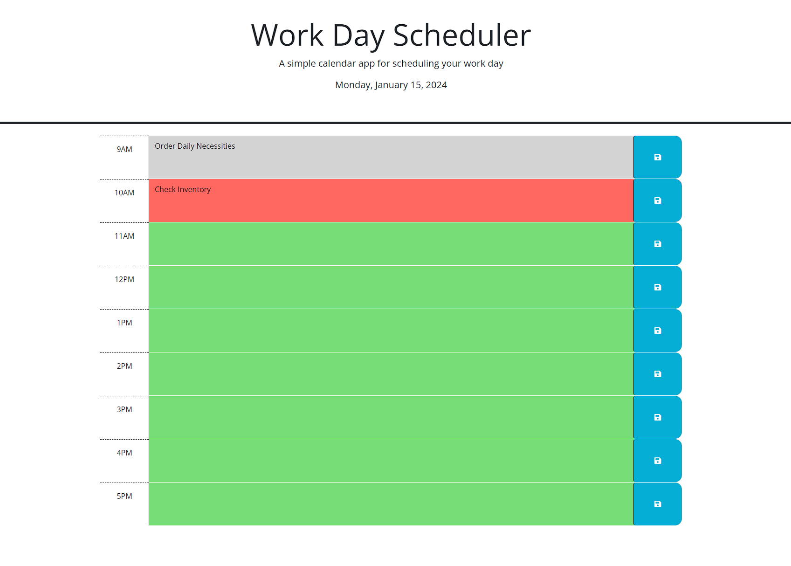

# Work Day Scheduler

A simple calendar app for scheduling your work day.

## Table of Contents
- [Overview](#overview)
- [Features](#features)
- [Usage](#usage)
- [How to Run](#how-to-run)
- [License](#license)
- [Questions](#questions)

## Overview

This Work Day Scheduler allows users to plan their work day by scheduling events for each hour from 9 AM to 5 PM. It provides a clean and user-friendly interface for managing daily tasks.

## Features

- Display the current day at the top of the calendar.
- Present time blocks for standard business hours (9 AM to 5 PM).
- Color-code time blocks to indicate whether they are in the past, present, or future.
- Allow users to enter events for each time block.
- Save entered events in local storage.
- Persist saved events even after refreshing the page.

## Usage

1. Open the Work Day Scheduler in your web browser.
2. View and interact with the time blocks for each hour.
3. Enter events in the provided text areas.
4. Click the save button to save the entered events in local storage.
5. Refresh the page, and the saved events should persist.

## How to Run

1. Clone this repository to your local machine.
2. Open the `index.html` file in your web browser.

## Questions

👋 Hi, I'm Gary, a student passionate about web development.

- 🔭 Currently exploring the world of web technologies.
- 🌱 Learning and building projects to enhance my skills.
- 💬 Let's connect! Feel free to reach out to me on [GitHub](https://github.com/garym636).